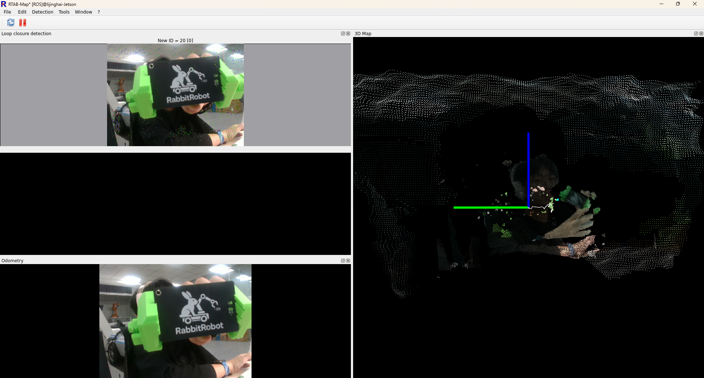
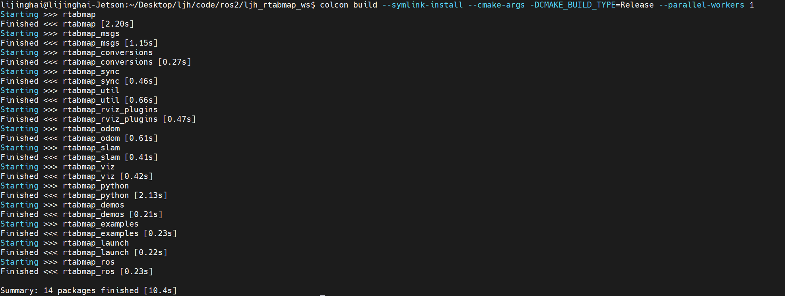
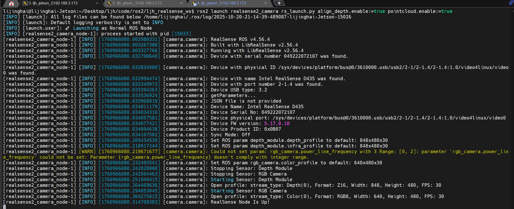
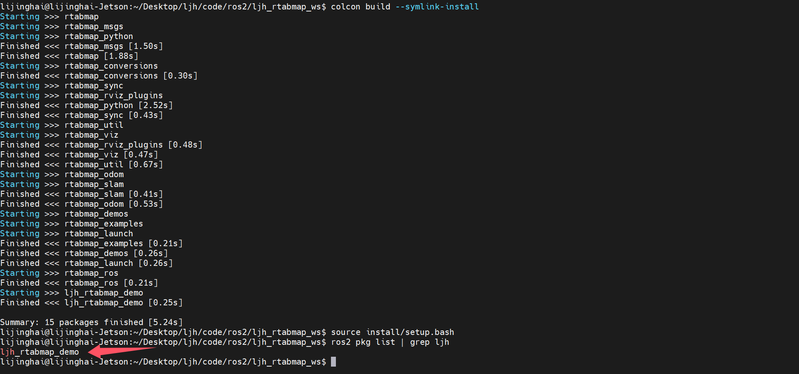
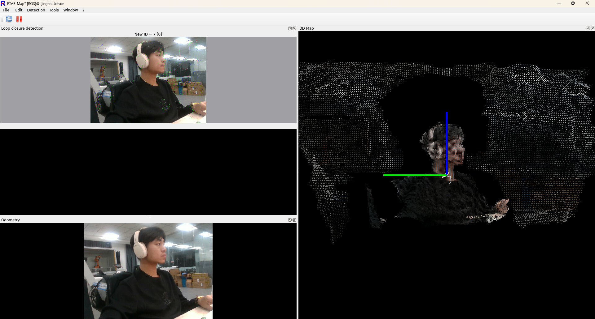

<h1 align="center">
  🐇 RabbitRobot-D435-L1lidar-RTABMap-ROS2  
</h1>

<h3 align="center">
  RTAB-Map 融合 LiDAR 与双目相机的建图导航
</h3>
> [!note]
>
> &emsp;&emsp;本项目基于 LiDAR、RGB-D 相机与 IMU 的多模态融合技术，为实现了移动小车的 三维建图与自主导航为目标。系统采用 Unitree L1 激光雷达 提供高精度几何结构信息，结合 Intel RealSense D435 相机 提供彩色与深度数据，并融合 MPU6050 惯性测量单元 (IMU) 实现姿态与运动状态的补偿与优化。
> 通过 FAST-LIO2 与 RTAB-Map 的多源融合建图算法，系统能够在复杂环境下实现高精度的环境感知、鲁棒的位姿估计与实时自主导航功能，为 多传感器融合 SLAM 与智能移动机器人研究 提供了一个可靠的实验与开发平台。
>
> &emsp;&emsp;This project integrates LiDAR (Unitree L1), RGB-D camera (Intel RealSense D435), and IMU (MPU6050) to achieve 3D mapping and autonomous navigation for mobile robots.
> &emsp;&emsp;Using FAST-LIO2 and RTAB-Map, the system fuses geometric, visual, and inertial information to provide robust localization and environmental understanding even in complex scenarios, offering a reliable platform for multi-sensor SLAM research and intelligent robotics.



# 一、创建RTABMap工作目录

```bash
sudo mkidr -p ljh_rtabmap_ws/src
cd ljh_rtabmap_ws/src
git clone -b humble-devel https://github.com/introlab/rtabmap.git
git clone -b humble-devel https://github.com/introlab/rtabmap_ros.git
cd ..
rosdep install --from-paths src --ignore-src -r -y
colcon build --symlink-install --parallel-workers 1 --cmake-args -DCMAKE_BUILD_TYPE=Release -Wno-dev
source install/setup.bash
```

## 1.1 编译安装

```bash
colcon build --symlink-install --cmake-args -DCMAKE_BUILD_TYPE=Release --parallel-workers 1
```



## 1.2 启动D435结点

```bash
ros2 launch realsense2_camera rs_launch.py align_depth.enable:=true pointcloud.enable:=true
```



## 1.3 查看D435结点信息

```bash
lijinghai@lijinghai-Jetson:~$ ros2 topic list
/camera/camera/aligned_depth_to_color/camera_info
/camera/camera/aligned_depth_to_color/image_raw
/camera/camera/color/camera_info
/camera/camera/color/image_raw
/camera/camera/color/metadata
/camera/camera/depth/camera_info
/camera/camera/depth/image_rect_raw
/camera/camera/depth/metadata
/camera/camera/extrinsics/depth_to_color
/parameter_events
/rosout
/tf_static
```

# 二、创建自定义D435 + RTABMap空间

## 2.1 在RTABMap 工作目录下创建 ljh_rtabmap_demo

```bash
~/Desktop/ljh/code/ros2/ljh_rtabmap_ws/src/
├── rtabmap_ros/
│   ├── rtabmap_odom/
│   ├── rtabmap_slam/
│   └── ...
└── ljh_rtabmap_demo/
    ├── package.xml
    ├── CMakeLists.txt
    └── launch/
        └── realsense_d435_color.launch.py
```

## 2.2 创建 package.xml

```xml
<?xml version="1.0"?>
<package format="3">
  <name>ljh_rtabmap_demo</name>
  <version>0.0.1</version>
  <description>
    RTAB-Map demo integrating RealSense D435 and LiDAR (L1) sensors in ROS 2.
  </description>

  <maintainer email="lijinghailjh@163.com">Li Jinghai</maintainer>
  <license>MIT</license>

  <!-- 依赖声明 -->
  <buildtool_depend>ament_cmake</buildtool_depend>

  <!-- RTAB-Map 功能依赖 -->
  <depend>rtabmap_ros</depend>
  <depend>rtabmap_slam</depend>
  <depend>rtabmap_odom</depend>
  <depend>rtabmap_viz</depend>

  <!-- RealSense 相机驱动 -->
  <depend>realsense2_camera</depend>

  <!-- IMU 滤波 -->
  <depend>imu_filter_madgwick</depend>

  <!-- ROS 2 基础包 -->
  <depend>rclcpp</depend>
  <depend>sensor_msgs</depend>
  <depend>std_msgs</depend>

  <export>
    <build_type>ament_cmake</build_type>
  </export>
</package>

```

## 2.3 创建CMakeLists.txt

```bash
cmake_minimum_required(VERSION 3.5)
project(ljh_rtabmap_demo)

# 使用 ament_cmake
find_package(ament_cmake REQUIRED)

# 依赖包（必须和 package.xml 保持一致）
find_package(rtabmap_ros REQUIRED)
find_package(realsense2_camera REQUIRED)
find_package(imu_filter_madgwick REQUIRED)
find_package(rclcpp REQUIRED)
find_package(sensor_msgs REQUIRED)
find_package(std_msgs REQUIRED)

# 安装 launch 文件
install(DIRECTORY launch
  DESTINATION share/${PROJECT_NAME}/
)

ament_package()

```

## 2.4 创建D435 + RTABMap launch文件

```bash
# ============================================================
#                        算个文科生吧
#                   lijinghailjh@163.com
# ============================================================
#  File: realsense_d435_color.launch.py
#  Description:
#     启动 Intel RealSense D435 彩色 + 深度 相机，
#     并运行 RTAB-Map SLAM（包含里程计、建图与可视化）。
#
#  Requirements:
#     1. 一台 Intel RealSense D435 相机（非 D435i）
#     2. 已安装 realsense2_camera ROS 2 包：
#        sudo apt install ros-$ROS_DISTRO-realsense2-camera
#     3. 已安装 rtabmap_ros 包：
#        sudo apt install ros-$ROS_DISTRO-rtabmap-ros
#
#  Usage:
#     ros2 launch ljh_rtabmap_demo realsense_d435_color.launch.py
# ============================================================

import os
from ament_index_python.packages import get_package_share_directory
from launch import LaunchDescription
from launch_ros.actions import Node, SetParameter
from launch.actions import DeclareLaunchArgument, IncludeLaunchDescription
from launch.launch_description_sources import PythonLaunchDescriptionSource
from launch.substitutions import LaunchConfiguration


def generate_launch_description():
    """
    generate_launch_description() 是 ROS 2 启动文件的主入口函数。
    它返回一个 LaunchDescription 对象，包含所有需要同时启动的节点。
    """

    # ============================================================
    #   RTAB-Map 公共参数
    # ============================================================
    parameters = [{
        # 相机的参考坐标系（TF 框架的根节点）
        'frame_id': 'camera_link',

        # 是否订阅深度图像
        'subscribe_depth': True,

        # 是否启用近似时间同步
        # 若 CPU 性能较弱，可设置 True（但建图精度略降）
        'approx_sync': False,
    }]

    # ============================================================
    #    话题重映射（Remappings）
    #    用于对齐不同节点的输入/输出话题名称。
    # ============================================================
    remappings = [
        # 将 RTAB-Map 的 RGB 图像输入映射到 RealSense 彩色图像话题
        ('rgb/image', '/camera/color/image_raw'),

        # 相机内参信息
        ('rgb/camera_info', '/camera/color/camera_info'),

        # 深度图像输入，使用对齐到彩色图的深度图
        ('depth/image', '/camera/aligned_depth_to_color/image_raw')
    ]

    # ============================================================
    #   返回 LaunchDescription 对象，包含所有子节点与参数
    # ============================================================
    return LaunchDescription([

        # ------------------------------------------------------------
        # DeclareLaunchArgument：声明命令行可传入的参数
        #   例如：
        #   ros2 launch ljh_rtabmap_demo realsense_d435_color.launch.py args:="--Vis/MinDepth 0.3"
        # ------------------------------------------------------------
        DeclareLaunchArgument(
            'args', default_value='',
            description='额外参数，用于设置 RTAB-Map 主节点和里程计节点的运行参数。'
        ),

        DeclareLaunchArgument(
            'odom_args', default_value='',
            description='仅传递给里程计节点的额外参数（优先级高于 args）。'
        ),

        # ------------------------------------------------------------
        # IncludeLaunchDescription：
        #   启动 RealSense 官方相机驱动（realsense2_camera）
        # ------------------------------------------------------------
        IncludeLaunchDescription(
            PythonLaunchDescriptionSource([
                os.path.join(
                    # 获取 realsense2_camera 包路径
                    get_package_share_directory('realsense2_camera'),
                    'launch',
                    'rs_launch.py'
                )
            ]),
            launch_arguments={
                # 设置命名空间为空，方便后续话题简洁
                'camera_namespace': '',

                # 开启对齐（深度对齐到彩色图像）
                'align_depth.enable': 'true',

                # 启用所有传感器同步采样（保证彩色与深度帧时间一致）
                'enable_sync': 'true',

                # 彩色相机分辨率与帧率
                # 格式为：宽x高x帧率
                'rgb_camera.profile': '640x360x30',

                # 深度模块分辨率与帧率
                'depth_module.profile': '640x360x30',

                # 启用彩色相机
                'enable_color': 'true',

                # 启用深度相机
                'enable_depth': 'true',
            }.items(),
        ),

        # ------------------------------------------------------------
        #    RTAB-Map 视觉里程计节点
        #   功能：估计相机相对运动（位姿）
        # ------------------------------------------------------------
        Node(
            package='rtabmap_odom',         # 所属 ROS 包
            executable='rgbd_odometry',     # 可执行文件名
            output='screen',                # 日志输出到终端
            parameters=parameters,          # 共享参数
            arguments=[LaunchConfiguration("args"),
                       LaunchConfiguration("odom_args")],  # 可通过命令行附加参数
            remappings=remappings           # 话题映射
        ),

        # ------------------------------------------------------------
        #    RTAB-Map SLAM 主节点
        #   功能：执行建图、闭环检测、位置优化等
        # ------------------------------------------------------------
        Node(
            package='rtabmap_slam',
            executable='rtabmap',
            output='screen',
            parameters=parameters,
            remappings=remappings,
            # "-d" 表示启动时删除旧数据库，重新建图
            arguments=['-d', LaunchConfiguration("args")]
        ),

        # ------------------------------------------------------------
        #    RTAB-Map 可视化界面
        #   功能：显示相机轨迹、点云地图、关键帧等
        # ------------------------------------------------------------
        Node(
            package='rtabmap_viz',
            executable='rtabmap_viz',
            output='screen',
            parameters=parameters,
            remappings=remappings
        ),
    ])
```

## 2.5 编译

```bash
colcon build --symlink-install
source install/setup.bash
ros2 pkg list | grep ljh
```



### 2.6  启动 D435 + RTAB-Map 建图

```bash
ros2 launch ljh_rtabmap_demo realsense_d435_color.launch.py
```


