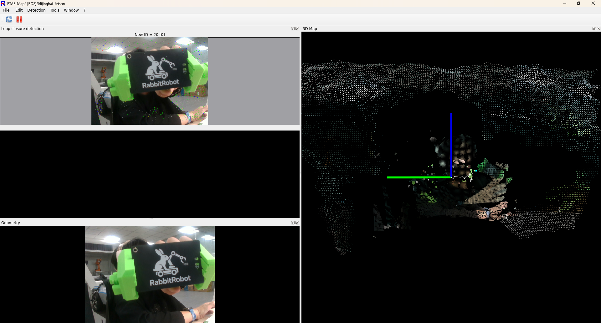
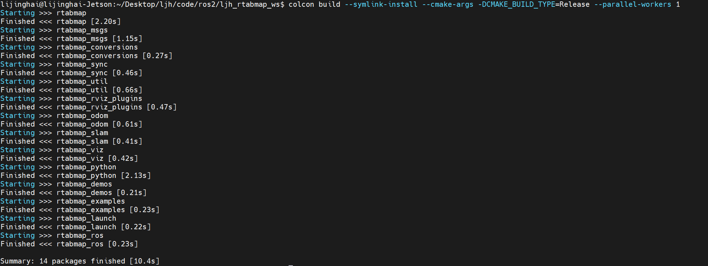
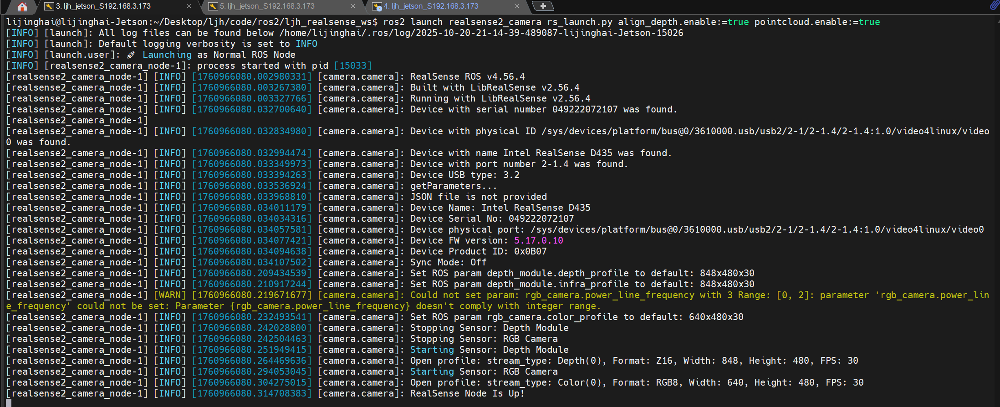
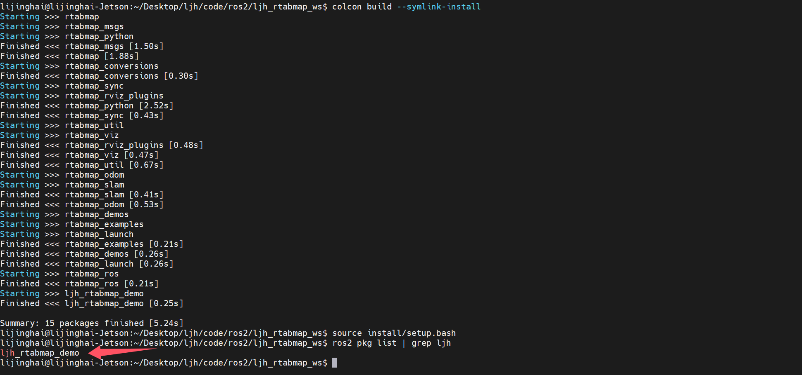
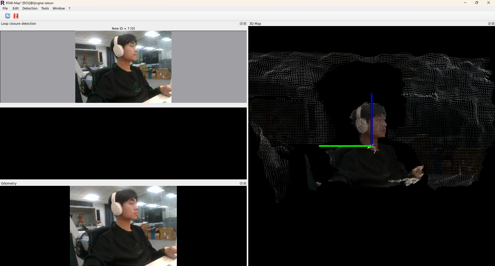
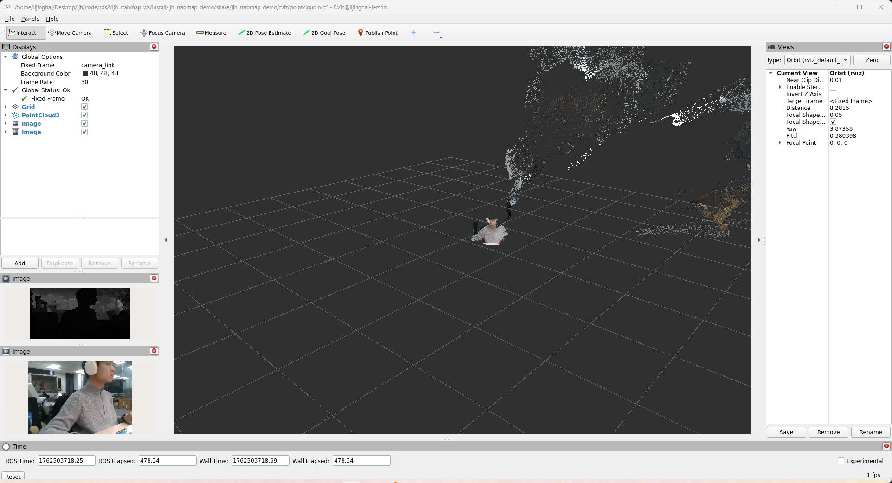

<h1 align="center">
  🐇 RabbitRobot-D435-L1lidar-RTABMap-ROS2  
</h1>

<h3 align="center">
  RTAB-Map 融合 LiDAR 与双目相机的建图导航
</h3>


> [!note]
>
> &emsp;&emsp;本项目基于 LiDAR、RGB-D 相机与 IMU 的多模态融合技术，为实现了移动小车的 三维建图与自主导航为目标。系统采用 Unitree L1 激光雷达 提供高精度几何结构信息，结合 Intel RealSense D435 相机 提供彩色与深度数据，并融合 MPU6050 惯性测量单元 (IMU) 实现姿态与运动状态的补偿与优化。
> 通过 FAST-LIO2 与 RTAB-Map 的多源融合建图算法，系统能够在复杂环境下实现高精度的环境感知、鲁棒的位姿估计与实时自主导航功能，为 多传感器融合 SLAM 与智能移动机器人研究 提供了一个可靠的实验与开发平台。
>
> &emsp;&emsp;This project integrates LiDAR (Unitree L1), RGB-D camera (Intel RealSense D435), and IMU (MPU6050) to achieve 3D mapping and autonomous navigation for mobile robots.
> &emsp;&emsp;Using FAST-LIO2 and RTAB-Map, the system fuses geometric, visual, and inertial information to provide robust localization and environmental understanding even in complex scenarios, offering a reliable platform for multi-sensor SLAM research and intelligent robotics.
>
> 

# 一、创建RTABMap工作目录

```bash
sudo mkidr -p ljh_rtabmap_ws/src
cd ljh_rtabmap_ws/src
git clone -b humble-devel https://github.com/introlab/rtabmap.git
git clone -b humble-devel https://github.com/introlab/rtabmap_ros.git
cd ..
rosdep install --from-paths src --ignore-src -r -y
colcon build --symlink-install --parallel-workers 1 --cmake-args -DCMAKE_BUILD_TYPE=Release -Wno-dev
source install/setup.bash
```

## 1.1 编译安装

```bash
colcon build --symlink-install --cmake-args -DCMAKE_BUILD_TYPE=Release --parallel-workers 1
```



## 1.2 启动D435结点

```bash
ros2 launch realsense2_camera rs_launch.py align_depth.enable:=true pointcloud.enable:=true
```



## 1.3 查看D435结点信息

```bash
lijinghai@lijinghai-Jetson:~$ ros2 topic list
/camera/camera/aligned_depth_to_color/camera_info
/camera/camera/aligned_depth_to_color/image_raw
/camera/camera/color/camera_info
/camera/camera/color/image_raw
/camera/camera/color/metadata
/camera/camera/depth/camera_info
/camera/camera/depth/image_rect_raw
/camera/camera/depth/metadata
/camera/camera/extrinsics/depth_to_color
/parameter_events
/rosout
/tf_static
```

# 二、创建自定义D435 + RTABMap空间

## 2.1 在RTABMap 工作目录下创建 ljh_rtabmap_demo

```bash
~/Desktop/ljh/code/ros2/ljh_rtabmap_ws/src/
├── rtabmap_ros/
│   ├── rtabmap_odom/
│   ├── rtabmap_slam/
│   └── ...
└── ljh_rtabmap_demo/
    ├── package.xml
    ├── CMakeLists.txt
    └── launch/
        └── realsense_d435_color.launch.py
```

## 2.2 创建 package.xml

```xml
<?xml version="1.0"?>
<package format="3">
  <name>ljh_rtabmap_demo</name>
  <version>0.0.1</version>
  <description>
    RTAB-Map demo integrating RealSense D435 and LiDAR (L1) sensors in ROS 2.
  </description>

  <maintainer email="lijinghailjh@163.com">Li Jinghai</maintainer>
  <license>MIT</license>

  <!-- 依赖声明 -->
  <buildtool_depend>ament_cmake</buildtool_depend>

  <!-- RTAB-Map 功能依赖 -->
  <depend>rtabmap_ros</depend>
  <depend>rtabmap_slam</depend>
  <depend>rtabmap_odom</depend>
  <depend>rtabmap_viz</depend>

  <!-- RealSense 相机驱动 -->
  <depend>realsense2_camera</depend>

  <!-- IMU 滤波 -->
  <depend>imu_filter_madgwick</depend>

  <!-- ROS 2 基础包 -->
  <depend>rclcpp</depend>
  <depend>sensor_msgs</depend>
  <depend>std_msgs</depend>

  <export>
    <build_type>ament_cmake</build_type>
  </export>
</package>

```

## 2.3 创建CMakeLists.txt

```bash
cmake_minimum_required(VERSION 3.5)
project(ljh_rtabmap_demo)

# 使用 ament_cmake
find_package(ament_cmake REQUIRED)

# 依赖包（必须和 package.xml 保持一致）
find_package(rtabmap_ros REQUIRED)
find_package(realsense2_camera REQUIRED)
find_package(imu_filter_madgwick REQUIRED)
find_package(rclcpp REQUIRED)
find_package(sensor_msgs REQUIRED)
find_package(std_msgs REQUIRED)

# 安装 launch 文件
install(DIRECTORY launch
  DESTINATION share/${PROJECT_NAME}/
)

ament_package()

```

## 2.4 创建D435 + RTABMap launch文件

```bash
# ============================================================
#                        算个文科生吧
#                   lijinghailjh@163.com
# ============================================================
#  File: realsense_d435_color.launch.py
#  Description:
#     启动 Intel RealSense D435 彩色 + 深度 相机，
#     并运行 RTAB-Map SLAM（包含里程计、建图与可视化）。
#
#  Requirements:
#     1. 一台 Intel RealSense D435 相机（非 D435i）
#     2. 已安装 realsense2_camera ROS 2 包：
#        sudo apt install ros-$ROS_DISTRO-realsense2-camera
#     3. 已安装 rtabmap_ros 包：
#        sudo apt install ros-$ROS_DISTRO-rtabmap-ros
#
#  Usage:
#     ros2 launch ljh_rtabmap_demo realsense_d435_color.launch.py
# ============================================================

import os
from ament_index_python.packages import get_package_share_directory
from launch import LaunchDescription
from launch_ros.actions import Node, SetParameter
from launch.actions import DeclareLaunchArgument, IncludeLaunchDescription
from launch.launch_description_sources import PythonLaunchDescriptionSource
from launch.substitutions import LaunchConfiguration


def generate_launch_description():
    """
    generate_launch_description() 是 ROS 2 启动文件的主入口函数。
    它返回一个 LaunchDescription 对象，包含所有需要同时启动的节点。
    """

    # ============================================================
    #   RTAB-Map 公共参数
    # ============================================================
    parameters = [{
        # 相机的参考坐标系（TF 框架的根节点）
        'frame_id': 'camera_link',

        # 是否订阅深度图像
        'subscribe_depth': True,

        # 是否启用近似时间同步
        # 若 CPU 性能较弱，可设置 True（但建图精度略降）
        'approx_sync': False,
    }]

    # ============================================================
    #    话题重映射（Remappings）
    #    用于对齐不同节点的输入/输出话题名称。
    # ============================================================
    remappings = [
        # 将 RTAB-Map 的 RGB 图像输入映射到 RealSense 彩色图像话题
        ('rgb/image', '/camera/color/image_raw'),

        # 相机内参信息
        ('rgb/camera_info', '/camera/color/camera_info'),

        # 深度图像输入，使用对齐到彩色图的深度图
        ('depth/image', '/camera/aligned_depth_to_color/image_raw')
    ]

    # ============================================================
    #   返回 LaunchDescription 对象，包含所有子节点与参数
    # ============================================================
    return LaunchDescription([

        # ------------------------------------------------------------
        # DeclareLaunchArgument：声明命令行可传入的参数
        #   例如：
        #   ros2 launch ljh_rtabmap_demo realsense_d435_color.launch.py args:="--Vis/MinDepth 0.3"
        # ------------------------------------------------------------
        DeclareLaunchArgument(
            'args', default_value='',
            description='额外参数，用于设置 RTAB-Map 主节点和里程计节点的运行参数。'
        ),

        DeclareLaunchArgument(
            'odom_args', default_value='',
            description='仅传递给里程计节点的额外参数（优先级高于 args）。'
        ),

        # ------------------------------------------------------------
        # IncludeLaunchDescription：
        #   启动 RealSense 官方相机驱动（realsense2_camera）
        # ------------------------------------------------------------
        IncludeLaunchDescription(
            PythonLaunchDescriptionSource([
                os.path.join(
                    # 获取 realsense2_camera 包路径
                    get_package_share_directory('realsense2_camera'),
                    'launch',
                    'rs_launch.py'
                )
            ]),
            launch_arguments={
                # 设置命名空间为空，方便后续话题简洁
                'camera_namespace': '',

                # 开启对齐（深度对齐到彩色图像）
                'align_depth.enable': 'true',

                # 启用所有传感器同步采样（保证彩色与深度帧时间一致）
                'enable_sync': 'true',

                # 彩色相机分辨率与帧率
                # 格式为：宽x高x帧率
                'rgb_camera.profile': '640x360x30',

                # 深度模块分辨率与帧率
                'depth_module.profile': '640x360x30',

                # 启用彩色相机
                'enable_color': 'true',

                # 启用深度相机
                'enable_depth': 'true',
            }.items(),
        ),

        # ------------------------------------------------------------
        #    RTAB-Map 视觉里程计节点
        #   功能：估计相机相对运动（位姿）
        # ------------------------------------------------------------
        Node(
            package='rtabmap_odom',         # 所属 ROS 包
            executable='rgbd_odometry',     # 可执行文件名
            output='screen',                # 日志输出到终端
            parameters=parameters,          # 共享参数
            arguments=[LaunchConfiguration("args"),
                       LaunchConfiguration("odom_args")],  # 可通过命令行附加参数
            remappings=remappings           # 话题映射
        ),

        # ------------------------------------------------------------
        #    RTAB-Map SLAM 主节点
        #   功能：执行建图、闭环检测、位置优化等
        # ------------------------------------------------------------
        Node(
            package='rtabmap_slam',
            executable='rtabmap',
            output='screen',
            parameters=parameters,
            remappings=remappings,
            # "-d" 表示启动时删除旧数据库，重新建图
            arguments=['-d', LaunchConfiguration("args")]
        ),

        # ------------------------------------------------------------
        #    RTAB-Map 可视化界面
        #   功能：显示相机轨迹、点云地图、关键帧等
        # ------------------------------------------------------------
        Node(
            package='rtabmap_viz',
            executable='rtabmap_viz',
            output='screen',
            parameters=parameters,
            remappings=remappings
        ),
    ])
```

## 2.5 编译

```bash
colcon build --symlink-install
source install/setup.bash
ros2 pkg list | grep ljh
```



## 2.6  启动 D435 + RTAB-Map UI 可视化数据界面

```bash
ros2 launch ljh_rtabmap_demo realsense_d435_color.launch.py
```



## 2.7 启动 rviz2可视化数据界面

### 1.按下键盘（ctrl+alt+t）打开第三个终端，运行下面的指令，启动Rtabmap SLAM建图。

```bash
ros2 launch rtabmap_demos ljh_mapping_demo.launch.py rviz:=true rtabmap_viz:=true
```

```bash
# ============================================================
#                        算个文科生吧
#                   lijinghailjh@163.com
# ============================================================
#  File: ljh_rs_pointcloud_launch.py
#  Description:
#     基于 realsense2_camera 官方 rs_pointcloud_launch.py 修改，
#     针对 Intel RealSense D435 优化，自动启用彩色点云。
#     启动后自动打开 RViz2 并显示彩色点云。
#
#  Usage:
#     ros2 launch ljh_rtabmap_demo ljh_rs_pointcloud_launch.py
#
#  可选参数：
#     ros2 launch ljh_rtabmap_demo ljh_rs_pointcloud_launch.py camera_name:=my_camera
#     ros2 launch ljh_rtabmap_demo ljh_rs_pointcloud_launch.py camera_namespace:=my_namespace
#     ros2 launch ljh_rtabmap_demo ljh_rs_pointcloud_launch.py rviz_config:=/path/to/your/config.rviz
#
#  重要提示：
#     - 启动前请确保没有其他 RealSense 节点在运行
#     - 如果出现 "Depth stream start failure" 错误，先执行：
#       pkill -f realsense2_camera_node
#     - 然后重新启动本文件
#
#  功能说明：
#     - 自动启动 RealSense D435 相机
#     - 自动启用深度对齐和同步
#     - 自动启用彩色点云发布
#     - 自动打开 RViz2 并加载点云显示配置
#     - 点云话题：/camera/depth/color/points（默认配置）
# ============================================================

"""Launch realsense2_camera node with pointcloud for D435."""
from launch import LaunchDescription
from launch.actions import OpaqueFunction, TimerAction, ExecuteProcess, DeclareLaunchArgument
from launch.conditions import IfCondition
from launch.substitutions import LaunchConfiguration, ThisLaunchFileDir, PathJoinSubstitution
from launch_ros.actions import Node
import launch_ros.actions
import sys
import pathlib
import os
from ament_index_python.packages import get_package_share_directory

# 添加 realsense2_camera launch 目录到路径
sys.path.append(os.path.join(get_package_share_directory('realsense2_camera'), 'launch'))
import rs_launch

# 本地参数定义（可被命令行覆盖）
local_parameters = [
    {'name': 'camera_name', 'default': 'camera', 'description': 'camera unique name'},
    {'name': 'camera_namespace', 'default': '', 'description': 'camera namespace (empty for simpler topics)'},
    {'name': 'enable_color', 'default': 'true', 'description': 'enable color stream'},
    {'name': 'enable_depth', 'default': 'true', 'description': 'enable depth stream'},
    {'name': 'pointcloud.enable', 'default': 'true', 'description': 'enable pointcloud'},
    # D435 特定优化参数
    {'name': 'align_depth.enable', 'default': 'true', 'description': 'align depth to color (required for colored pointcloud)'},
    {'name': 'enable_sync', 'default': 'true', 'description': 'enable frame synchronization'},
    {'name': 'rgb_camera.profile', 'default': '640x360x30', 'description': 'RGB camera profile (widthxheightxfps)'},
    {'name': 'depth_module.profile', 'default': '640x360x30', 'description': 'Depth module profile (widthxheightxfps)'},
]

def set_configurable_parameters(local_params):
    """将本地参数转换为 LaunchConfiguration 字典"""
    return dict([(param['name'], LaunchConfiguration(param['name'])) for param in local_params])


def setup_pointcloud_params(context):
    """设置点云参数的回调函数"""
    camera_name = context.launch_configurations.get('camera_name', 'camera')
    camera_namespace = context.launch_configurations.get('camera_namespace', '')
    
    # 构建节点完整路径
    # 当 camera_namespace 为空时，节点路径为 /camera_name
    # 当 camera_namespace 不为空时，节点路径为 /camera_namespace/camera_name
    if camera_namespace:
        node_path = f'/{camera_namespace}/{camera_name}'
    else:
        node_path = f'/{camera_name}'
    
    enable_cmd = (
        f"for i in {{1..10}}; do "
        f"ros2 param set {node_path} pointcloud__neon_.enable True >/dev/null 2>&1 && "
        f"break; "
        f"sleep 1; "
        f"done"
    )

    stream_filter_cmd = (
        f"for i in {{1..10}}; do "
        f"ros2 param set {node_path} pointcloud__neon_.stream_filter 2 >/dev/null 2>&1 && "
        f"break; "
        f"sleep 1; "
        f"done"
    )

    return [
        ExecuteProcess(cmd=['/bin/bash', '-c', enable_cmd], output='screen'),
        ExecuteProcess(cmd=['/bin/bash', '-c', stream_filter_cmd], output='screen')
    ]


def generate_launch_description():
    """生成启动描述"""
    # 获取所有可配置参数
    params = rs_launch.configurable_parameters
    
    # 合并本地参数和系统参数（本地参数包含 D435 优化设置）
    all_params = local_parameters + params
    
    # 声明 rviz 配置文件参数（可选）
    # 如果指定了 rviz_config，则使用指定的配置文件
    # 如果未指定，则使用默认路径或让 RViz2 使用默认配置
    rviz_config_arg = DeclareLaunchArgument(
        'rviz_config',
        default_value=PathJoinSubstitution([
            get_package_share_directory('ljh_rtabmap_demo'),
            'rviz',
            'pointcloud.rviz'
        ]),
        description='Path to RViz2 configuration file. If file does not exist, RViz2 will start with default config.'
    )
    
    return LaunchDescription(
        # 声明所有可配置参数
        [rviz_config_arg] +
        rs_launch.declare_configurable_parameters(local_parameters) +
        rs_launch.declare_configurable_parameters(params) +
        [
            # 启动 RealSense 相机节点
            # 传递所有参数（包括本地定义的 D435 优化参数）
            OpaqueFunction(
                function=rs_launch.launch_setup,
                kwargs={'params': set_configurable_parameters(all_params)}
            ),
            
            # 延迟设置点云参数（RealSense 节点启动后 3 秒设置）
            # 点云参数无法在 launch_arguments 中直接设置，需要启动后设置
            # 使用 OpaqueFunction 来动态获取 camera_name 和 camera_namespace
            TimerAction(
                period=3.0,
                actions=[
                    OpaqueFunction(function=setup_pointcloud_params)
                ]
            ),
            
            # 启动 RViz2 用于可视化点云
            # 如果指定了 rviz_config 参数，则加载该配置文件
            launch_ros.actions.Node(
                package='rviz2',
                namespace='',
                executable='rviz2',
                name='rviz2',
                output='screen',
                arguments=['-d', LaunchConfiguration('rviz_config')]
            )
        ]
    )
    

```

## 2.8 Rviz2成像



## 2.9 加入imu

```bash
# ============================================================
#                        算个文科生吧
#                   lijinghailjh@163.com
# ============================================================
#  File: ljh_rs_pointcloud_mpu6050.launch.py
#  Description:
#     RealSense D435 点云 + 外部 MPU6050 IMU 一键可视化。
#     - 启动 RealSense 彩色/深度及彩色点云
#     - 自动启用 Madgwick IMU 滤波，发布带姿态的 /imu_filtered
#     - 可选发布 IMU -> 相机的静态 TF
#     - 自动打开 RViz2 显示点云
#
#  Usage:
#     ros2 launch ljh_rtabmap_demo ljh_rs_pointcloud_mpu6050.launch.py
#
#  可选参数：
#     ros2 launch ljh_rtabmap_demo ljh_rs_pointcloud_mpu6050.launch.py \
#          imu_raw_topic:=/imu imu_filtered_topic:=/imu_filtered \
#          imu_to_cam_tx:=0.0 imu_to_cam_ty:=0.02 imu_to_cam_tz:=-0.03
#
#  注意：
#     - 请先确保 mpu6050driver 节点已运行并发布 IMU 数据
#     - 若已有其他 RealSense 节点，请先 pkill -f realsense2_camera_node
# ============================================================

"""Launch RealSense pointcloud with external MPU6050 IMU."""

import os
import sys

from ament_index_python.packages import get_package_share_directory
from launch import LaunchDescription
from launch.actions import DeclareLaunchArgument, ExecuteProcess, OpaqueFunction, TimerAction
from launch.substitutions import LaunchConfiguration, PathJoinSubstitution
from launch_ros.actions import Node

# 加载 realsense 官方 launch 模块
sys.path.append(os.path.join(get_package_share_directory('realsense2_camera'), 'launch'))
import rs_launch  # type: ignore  # noqa: E402


# ============================================================
#   参数定义
# ============================================================
local_parameters = [
    {'name': 'camera_name', 'default': 'camera', 'description': 'camera unique name'},
    {'name': 'camera_namespace', 'default': '', 'description': 'camera namespace (empty for simpler topics)'},
    {'name': 'serial_no', 'default': '', 'description': 'RealSense device serial number (optional)'},
    {'name': 'usb_port_id', 'default': '', 'description': 'RealSense USB port id (optional)'},
    {'name': 'enable_color', 'default': 'true', 'description': 'enable color stream'},
    {'name': 'enable_depth', 'default': 'true', 'description': 'enable depth stream'},
    {'name': 'pointcloud.enable', 'default': 'true', 'description': 'enable pointcloud'},
    {'name': 'align_depth.enable', 'default': 'true', 'description': 'align depth to color (required for colored pointcloud)'},
    {'name': 'enable_sync', 'default': 'true', 'description': 'enable frame synchronization'},
    {'name': 'rgb_camera.profile', 'default': '640x360x30', 'description': 'RGB camera profile (widthxheightxfps)'},
    {'name': 'depth_module.profile', 'default': '640x360x30', 'description': 'Depth module profile (widthxheightxfps)'}
]


def declare_argument(name: str, default: str, description: str) -> DeclareLaunchArgument:
    return DeclareLaunchArgument(name, default_value=default, description=description)


def set_configurable_parameters(local_params):
    """将本地参数转换为 LaunchConfiguration 字典"""
    return {param['name']: LaunchConfiguration(param['name']) for param in local_params}


def declare_configurable_parameters(local_params):
    return [DeclareLaunchArgument(param['name'], default_value=param['default'], description=param['description']) for param in local_params]


def setup_pointcloud_params(context):
    """realsense 节点启动后，循环设置 pointcloud 参数"""
    camera_name = context.launch_configurations.get('camera_name', 'camera')
    camera_namespace = context.launch_configurations.get('camera_namespace', '')

    node_path = f"/{camera_namespace}/{camera_name}" if camera_namespace else f"/{camera_name}"

    enable_cmd = (
        f"for i in {{1..10}}; do "
        f"ros2 param set {node_path} pointcloud__neon_.enable True >/dev/null 2>&1 && break; "
        f"sleep 1; "
        f"done"
    )

    stream_cmd = (
        f"for i in {{1..10}}; do "
        f"ros2 param set {node_path} pointcloud__neon_.stream_filter 2 >/dev/null 2>&1 && break; "
        f"sleep 1; "
        f"done"
    )

    return [
        ExecuteProcess(cmd=['/bin/bash', '-c', enable_cmd], output='screen'),
        ExecuteProcess(cmd=['/bin/bash', '-c', stream_cmd], output='screen')
    ]


def generate_launch_description() -> LaunchDescription:
    # realsense 可配置参数
    rs_params = rs_launch.configurable_parameters
    all_params = local_parameters + rs_params

    # Launch 参数声明
    launch_args = [
        declare_argument('rviz_config', PathJoinSubstitution([
            get_package_share_directory('ljh_rtabmap_demo'), 'rviz', 'pointcloud.rviz'
        ]), 'RViz2 配置文件路径'),
        declare_argument('config_file', PathJoinSubstitution([
            get_package_share_directory('ljh_rtabmap_demo'),
            'config',
            'realsense_empty.json'
        ]), 'RealSense 相机 JSON 配置文件路径（可选）'),
        declare_argument('imu_raw_topic', '/imu', '原始 IMU 话题（mpu6050driver 输出）'),
        declare_argument('imu_filtered_topic', '/imu_filtered', '姿态解算后的 IMU 话题'),
        declare_argument('camera_frame', 'camera_link', 'RealSense 相机坐标系'),
        declare_argument('imu_frame', 'imu_link', 'IMU 坐标系名称'),
        declare_argument('imu_to_cam_tx', '0.0', 'IMU 相对于相机的 X 平移 (m)'),
        declare_argument('imu_to_cam_ty', '0.0', 'IMU 相对于相机的 Y 平移 (m)'),
        declare_argument('imu_to_cam_tz', '0.0', 'IMU 相对于相机的 Z 平移 (m)'),
        declare_argument('imu_to_cam_roll', '0.0', 'IMU 相对于相机的 Roll (rad, about X)'),
        declare_argument('imu_to_cam_pitch', '0.0', 'IMU 相对于相机的 Pitch (rad, about Y)'),
        declare_argument('imu_to_cam_yaw', '0.0', 'IMU 相对于相机的 Yaw (rad, about Z)')
    ]

    # RealSense 官方驱动
    realsense_launch = OpaqueFunction(
        function=rs_launch.launch_setup,
        kwargs={'params': set_configurable_parameters(all_params)}
    )

    # IMU Madgwick 滤波器
    imu_filter_node = Node(
        package='imu_filter_madgwick',
        executable='imu_filter_madgwick_node',
        name='imu_filter',
        output='screen',
        parameters=[{
            'use_magnetic_field': False,
            'world_frame': 'enu',
            'publish_tf': False,
        }],
        remappings=[
            ('imu/data_raw', LaunchConfiguration('imu_raw_topic')),
            ('imu/data', LaunchConfiguration('imu_filtered_topic')),
        ],
    )

    # IMU -> 相机静态 TF（可修改平移/姿态）
    static_tf_node = Node(
        package='tf2_ros',
        executable='static_transform_publisher',
        name='imu_to_camera_tf',
        arguments=[
            LaunchConfiguration('imu_to_cam_tx'),
            LaunchConfiguration('imu_to_cam_ty'),
            LaunchConfiguration('imu_to_cam_tz'),
            LaunchConfiguration('imu_to_cam_roll'),
            LaunchConfiguration('imu_to_cam_pitch'),
            LaunchConfiguration('imu_to_cam_yaw'),
            LaunchConfiguration('imu_frame'),
            LaunchConfiguration('camera_frame'),
        ],
        output='screen',
    )

    # RViz2 可视化
    rviz_node = Node(
        package='rviz2',
        executable='rviz2',
        name='rviz2',
        output='screen',
        arguments=['-d', LaunchConfiguration('rviz_config')]
    )

    ld = LaunchDescription()
    for arg in launch_args:
        ld.add_action(arg)

    for decl in declare_configurable_parameters(local_parameters):
        ld.add_action(decl)

    for decl in rs_launch.declare_configurable_parameters(rs_params):
        ld.add_action(decl)

    ld.add_action(realsense_launch)
    ld.add_action(imu_filter_node)
    ld.add_action(TimerAction(period=1.0, actions=[static_tf_node]))
    ld.add_action(TimerAction(period=3.0, actions=[OpaqueFunction(function=setup_pointcloud_params)]))
    ld.add_action(rviz_node)

    return ld

```


> [!note]
>
> MPU6050 接入ROS2 请看 https://github.com/lijinghai/RabbitRobot-JetsonOrinSuper_MPU6050-ROS2


---

## 📊 Star 历史

[](https://star-history.com/#lijinghai/RabbitRobot-D435-L1lidar-RTABMap-ROS2&Date)

---
<div align="center">

## 算个文科生吧

**Made with ❤️ for Robotics**

</div>
